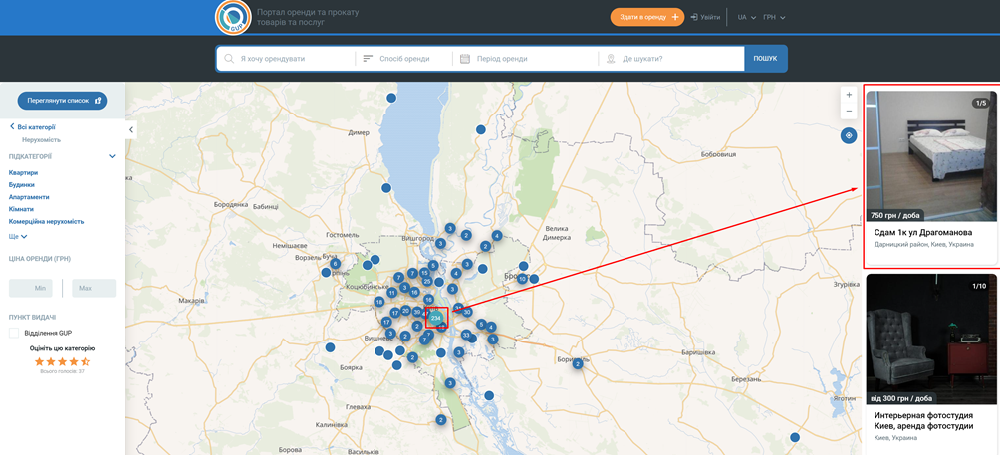

# Implementation of test task for Luxe Quality Company

## Description of the task

- Implement a website locally. Use as an example [https://rentzila.com.ua/products/](https://rentzila.com.ua/products/)
- A map must be integrated into the site. When you click on the mark on the map, information with the photo should appear on the right.
- It is also necessary to implement the functionality of adding an ad. After adding, one more mark on the map and information should be added (Rent button).
- By default, a list of all available ads on the map should be displayed on the right (if we enlarge the map, only those ads that are in this area should be displayed on the right)
- All added data is stored in Local storage

### An example of what it should look like is given below

## Technologies used
- React
- SCSS
- HTML
- React-leaflet library
- UUID library

## [DEMO Link of Application](https://leonid-vegera.github.io/rent-site/)
